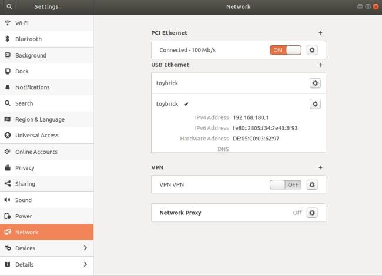
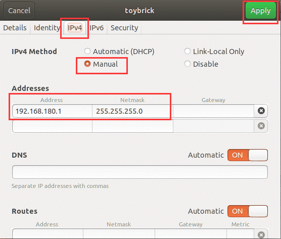
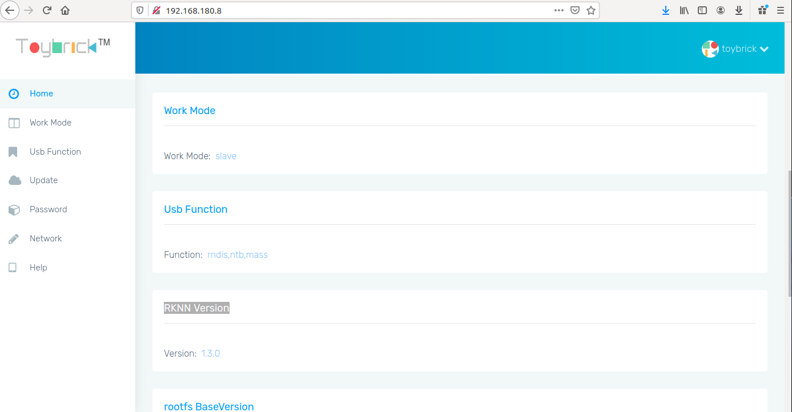

# DTSIS: Enviornment Setup for RKNN
### Authored by: Syed Saad Saif

## _**Read README.md before you continue!**_

Before we can use the RK1808S0 Stick we need to perform enviornment setup.


* ### Install conda to manage our virtual enviornment. (Skip this step already installed)

    1. Download the miniconda installer from [here.](https://docs.conda.io/en/latest/miniconda.html#linux-installers)

    1. Alternatively, use the downloaded version at: &nbsp; ```~/ai/dependencies/Miniconda3-latest-Linux-x86_64.sh```

    1. Make script executable: (Replace with real script name)   
        > ### chmod +x <name_of_installer_script.sh>

    1. Execute the script: (Replace with real script name)
        > ### ./<name_of_installer_script.sh>

    1. press **S** to skip EULA. Agree to the prompts.

    1. Close and reopen the terminal **OR** run:
        > ### source ~/.bashrc 

* ### Create a virtual enviornment named **rknn_cpu** with python version **3.6.9**
    > ### conda create --name rknn_cpu python=3.6.9

* ### Activate the newly created enviornment:
    
    > ### conda activate rknn_cpu 

    Note: The enviornment can be deactivated by: **conda deactivate**
* ### Verify the python version:

    > ### python3 --version

    ```bash
        > Python 3.6.9 :: Anaconda, Inc.
    ```
* ## Install required packages.

    1. Install openCV:
        > ### pip3 install opencv-python
    2. Install Tensorflow:
        > ### pip3 install --user tensorflow==1.14

    1. Download the rknn toolkit [here.](https://github.com/rockchip-linux/rknn-toolkit/releases/download/v1.4.0/rknn-toolkit-v1.4.0-packages.zip) (version 1.4.0)
        * Extract the zip archive.

        * Navigate to the extracted folder.

        ### OR

    1. Navigate to: ```~/ai/dependencies/rknn-toolkit-v1.4.0-packages/packages/```

    1. Run:
        > ### pip3 install rknn_toolkit-1.4.0-cp36-cp36m-linux_x86_64.whl

    1. To verify if the toolkit is installed run:

        * > ### pip3 list | grep rknn-toolkit
        
            ```
            rknn-toolkit         1.4.0
            ```
        
        * Run python shell and import package.

            > python3
            
            On the python interpreter run:

            ```python
            Python 3.6.9 |Anaconda, Inc.| (default, Jul 30 2019, 19:07:31) 
            [GCC 7.3.0] on linux
            Type "help", "copyright", "credits" or "license" for more information.
            >>> from rknn.api import RKNN
            >>> RKNN.__verison__
            ``` 
            If there are no errors then the toolkit is installed sucessfully


* ## Giving USB Compute Stick required permissions  
    1. Plug the Compute Stick in to the USB port of your device.
    
    1. Run:
        
        > ### lsusb

        ```bash
        Bus 002 Device 004: ID 2207:0018
        Bus 002 Device 003: ID 0bda:8153 Realtek Semiconductor Corp. 
        Bus 002 Device 002: ID 05e3:0626 Genesys Logic, Inc. 
        Bus 002 Device 001: ID 1d6b:0003 Linux Foundation 3.0 root hub
        Bus 001 Device 006: ID 04f3:0903 Elan Microelectronics Corp. 
        Bus 001 Device 005: ID 8087:0a2b Intel Corp. 
        Bus 001 Device 004: ID 0bda:58e4 Realtek Semiconductor Corp. 
        Bus 001 Device 003: ID 046d:c534 Logitech, Inc. Unifying Receiver
        Bus 001 Device 007: ID 9636:9300  
        Bus 001 Device 002: ID 05e3:0610 Genesys Logic, Inc. 4-port hub
        Bus 001 Device 001: ID 1d6b:0002 Linux Foundation 2.0 root hub
        ```
        Make sure that you see the line with _**ID 2207:0018**_

        This device is the Compute Stick and it means that device is recognized by the computer.

        * To Store the **Bus** number and **Device** number as envoirnment varables run.

        _These variables will be used in the following steps._ 

    1. Navigate to: ```~/ai/rockchip/rknn-toolkit/platform-tools/update_rk_usb_rule/linux ```

    1. To make script executable run:
        > ### chmod +x ./update_rk1808_usb_rule.sh

    1. To change Compute Stick USB permissions run:
        > ### ./update_rk1808_usb_rule.sh

    1. To verify if the device permissions have been updated run:

        > ### ls -l /dev/bus/usb/$BUS/$DEVICE    
        ```bash
            crw-rw-rw- 1 root root 189, 131 Ağu 28 08:55 /dev/bus/usb/002/004
        ```
        Make sure that the permisions are as expected. i.e **crw-rw-rw-**

* ## Verify inference can be performed on the newly configured Compute Stick

    1. Navigate to: 
    
        ```~/ai/rockchip/rknn-toolkit/examples/tensorflow/ssd_mobilenet_v1``` 

    2. Run:

        > ### python3 ./ssd.py

        ```
        .
        .	
        .

        [DEBUG]:  1.1213785393071462e-05
        W When performing performance evaluation, inputs can be set to None to use fake inputs.
        ========================================================================
                                    Performance                              
        ========================================================================
        Total Time(us): 18642
        FPS: 53.64
        ========================================================================
        ```

        If there are no errors then the compute stick is working properly.

* ## Updating the USB Stick rootfs. (Optional but Recommended) 

    If you experienced any issues while performing the previous steps, updating the rootfs image might solve the problems. (incase of broken rootfs) 

    The USB stick must enter maskrom mode before it can be flashed.

    To enter maskrom mode:

    * Unplug the compute stick.
    * Plug the stick into the USB port, wait 3 - 10 seconds and unplug.
    * Repeat 5 times but do not unplug the fifth time.

    Navigate to: ```~/ai/rockchip/flashTool/unix```

    Run:

    > ### ./linux_flash.sh

* ## Setting up Network Address Translation (NAT) for the USB Stick.

    Setting up NAT is required for the stick to have access to the internet. This will be needed when we update the software and packages on the stick.

    The USB stick is recognized by the computer also as an ethernet adaptor, in this step we will use NAT to give the USB Compute Stick ethernet adaptor access to internet from our main ethernet port.

    1. To list connected ethernet adaptors run:

        > ### ifconfig

        ```
        enx00e04c68080d: flags=4163<UP,BROADCAST,RUNNING,MULTICAST>  mtu 1500
                inet 192.168.0.119  netmask 255.255.255.0  broadcast 192.168.0.255
                inet6 fe80::868f:33c5:6422:a080  prefixlen 64  scopeid 0x20<link>
                ether 00:e0:4c:68:08:0d  txqueuelen 1000  (Ethernet)
                RX packets 1905317  bytes 2083512252 (2.0 GB)
                RX errors 0  dropped 0  overruns 0  frame 0
                TX packets 757620  bytes 53580211 (53.5 MB)
                TX errors 0  dropped 0 overruns 0  carrier 0  collisions 0

        enx10dcb69f0f1d: flags=4163<UP,BROADCAST,RUNNING,MULTICAST>  mtu 1500
                inet 192.168.180.1  netmask 255.255.255.0  broadcast 192.168.180.255
                inet6 fe80::827c:7b60:bd3c:d773  prefixlen 64  scopeid 0x20<link>
                ether 10:dc:b6:9f:0f:1d  txqueuelen 1000  (Ethernet)
                RX packets 224  bytes 13400 (13.4 KB)
                RX errors 0  dropped 0  overruns 0  frame 0
                TX packets 251  bytes 46930 (46.9 KB)
                TX errors 0  dropped 0 overruns 0  carrier 0  collisions 0

        lo: flags=73<UP,LOOPBACK,RUNNING>  mtu 65536
                inet 127.0.0.1  netmask 255.0.0.0
                inet6 ::1  prefixlen 128  scopeid 0x10<host>
                loop  txqueuelen 1000  (Local Loopback)
                RX packets 12535  bytes 1265078 (1.2 MB)
                RX errors 0  dropped 0  overruns 0  frame 0
                TX packets 12535  bytes 1265078 (1.2 MB)
                TX errors 0  dropped 0 overruns 0  carrier 0  collisions 0

        ```
    Note the adaptor names that corresponds to our USB Compute stick and our primary ethernet adaptor. Set the shell enviornment variables.

    _**You can identify the entry corresponding to the USB Stick by unpluging, calling ifconfig and then noting the missing entry.**_
    
    > ### MAIN_ETH_NAME='enx00e04c68080d' (replace with your corresponding id)
    > ### STICK_ETH_NAME='enx10dcb69f0f1d' (replace with your corresponding id)

    #### Also note the MAC address of the USB Stick. 

    1. Select the USB Ethernet with the MAC address matching the compute stick. 
    

    1. Select the settings button and go to the IPv4 tab. 

        * Select **Manual** as IPv4 method
        * Set **ip address** as _192.168.180.1_
        * Set **netmask** as _255.255.255.0_
        * **Apply** settings

        

    1. Open web browser and to to address **192.168.180.8** and login.

        * Username: toybrick
        * Password: toybrick

    

    1. After logging in note the RKNN Version.

    


* ## Updating the USB Stick RKNN software.

