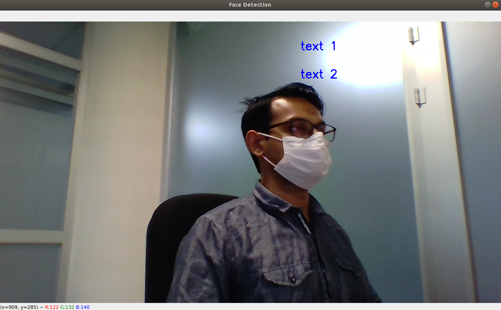

# DTSIS: Python Programmer's guide for Computer Vision

### Authored by: **Syed Saad Saif**

# Helper libraries and boilerplate code
All computer vision applications share a common steps which include:

* ### Frame capture from camera

* ### Image pre-processing

* ### AI Inference

* ### Result post-processing

* ### Image overlay and display

Furthermore, there are metrics that need to be calculated for performance evaluation. These metrics include.

* ### Average Frame Rate (FPS)

* ### Average Model Inference Time

* ### Pre-processing Time

* ### Post-processing Time

* ### Image Overlay and Draw Time

Since our work is primarily based on embedded systems improving performance by removing bottlenecks is a integral part of our work. Performance metrics are a useful tool to for this process.

As you can see that there is a lot of common work that needs to be done for a computer vision application. It is therefore a good idea to pre-establish a workflow and prepare libraries and boilerplate code to minimize time spent on repetitive pre-preparation. 

**Custom in-house helper python libraries and boilerplate codes are provided for your convenience.**

_**Note:** It might be useful to create your own packages and also make changes to existing ones. You can also upload to PyPI. To create your packages follow the resources provided below as a reference._ 

* [Making a python Package.](https://python-packaging-tutorial.readthedocs.io/en/latest/setup_py.html)
* [Beginner's Guide.](https://medium.com/swlh/beginners-guide-to-create-python-wheel-7d45f8350a94)
## Install libraries

_**Note: Make sure that you are in the desired conda virtual enviornment before proceeding with library installation.**_

1. Navigate to: ```~/ai/helper/libraries/wheels/```

1. Install the wheel packages:

    _**Note: Please pay attention to the version numbers as they might change with updates to packages, always install the latest version when multiple wheels are available.**_
    * To install multithreading video capture library run:
    > ### pip3 install dtsis_video_capture-1.0-py3-none-any.whl

    _**Note: This library is adapted form the project at: ```https://github.com/gilbertfrancois/video-capture-async```**_

    * To install the metrics library run:
    > ### pip3 install dtsis_metrics-1.0-py3-none-any.whl

    * ### Install the text overlay library by running:
    > ### pip3 install dtsis_text_overlay-1.0-py3-none-any.whl

Note that the source code of the wheels is also provided at ```~/ai/helper/libraries/source/``` and can be reviewed for better understanding how the code works. 

## Library APIs

### Video Capture Multithreading:

* Import the library like: 
    ```python
    from dtsis_capture import VideoCaptureThreading
    ```
* Initialize the capture stream like:
    ```python
    cap = VideoCaptureTreading(0, 1280, 720)
    ```
    The first argument is the **camera id**, then the desired **width** and **height** respectively.

* Initializing the capture stream does not automatically start the video stream. Start the stream by calling:

    ```python
    cap.start()
    ```

* To get the frame call:
    ```python
    ret, frame = cap.read()
    ```
    **ret** returns if the frame was captures sucessfully.
    
    The return value **ret** should be in a loop to make sure frame capture is sucessful before processing the frame. An example is as follows:

    ```python
        
    While True:
        if ret != True:
            continue
        (frame processing code)
    ```

    **frame** contains a numpy array of **shape = (HEIGHT, WIDTH, CHANNELS)** and data **type of uint8**. Pay attention to the shape of the frame. A lot of errors can be avoided in the shape is kept in mind. 

* Finally, stop device capture by calling:
    ```python
    cap.stop()
    ```

### Metrics 
The metrics library contains **fps**, **average** and **stopwatch** libraries:

## Usage:

1. ### **average**
    The _**average**_ library can be used to create a running average of noisy variables (such as model inference time) be able to better understand the evolution of the variable.

    1. Import the library:
        ```python
            from dtsis_metrics import average
        ```
    
    1. Create a new instance for every variable you want to average. Here we assume that we have a variable ```noisy_variable``` of which we would like to get a running average. Give the number of samples to average over as an argument to the constructor.

        ```python
        ...
        noisy_var_average = average(100)
        ```
    1. Pass the value the variable to be averaged. Consider we have a loop, we will pass the value of the variable at each loop iteration.
        ```python
        while True:
            #Value of noisy variable updated
            ...
            noisy_var_average.update(noisy_variable) 
        ```
    1. Get the averaged (running average) value of the variable by calling:
        
        ```python
            averaged_noisy_var = noisy_var_average.average()
        ```
        Please note that until the **update** method is called at least the **number of samples to average** (argument passed to the constructor) times, the **average** method will just return the latest value of the variable. 

1. ### **fps**

    The _**fps**_ library is a convenient way to calculate the fps of your main loop.

    ## Usage:

    1. Initialize the python fps function by:
        
        ```python
        fps_counter = fps()
        ```
        Note that the timer starts first timer starts as soon as you call the constructor so it is better to initialize it just before entering the loop. However note that this should only affect the first fps value and will not matter in the long run.

    1. Inside the loop call the update method at exactly once.
        ```python
        while True:
            ...
            #rest of code
            ...
            fps_counter.update()
        ```

    1. Get the current fps value by calling:
        ```python
            fps_value = fps.counter.get_fps()
        ```

1. ### **stopwatch**

    **stopwatch** is a convenience class to measure the processing time of functions and inference times of models.

    To import the class:
    ```python
    from dtsis_metrics import stopwatch
    ```

    Call the constructor:
    ```python
    sw = stopwatch()
    ```

    Call the **start** method before the function to be timed starts:
    ```python
    sw.start()
    ```

    Call the stop method after the function returns:
    ```python
    elapsed_time = sw.stop()
    ```

    
1. ### Text Overlay

    It is useful to show some information overlayed on the screen. opencv provides a function but it requries a lot of parameters to be calculated manually. This library provides a wrapper to the opencv text overlay function to make this a bit easier.

    ## Usage:

    1. Import the library:
        ```python
        from dtsis_text_overlay import text_overlay
        ```

    1. Initialize the text overlay the object by running the following command. Pass the **width** and **height** of the camera stream as the two parameters.

        ```python
        to = text_overlay(1280, 720)
        ```

    1. Update the frame to overlay text on by calling:

        ```python
        to.update_frame(frame)
        ```
    1. Overlay text by calling overlay text method. It takes two parameters, the text and the xpos. Text is just the string and the xpos is the position in decimal of the text starting position. For example a value of _**0.5**_ will put the text starting from the middle of the screen. This method can be called multiple times and the y position of the text will be automatically incremented.

        ```python
        to.overlay_text("text 1", 0.6)
        to.overlay_text("text 2", 0.6)
        ```
        

        Do keep in mind that text overlay only updates the frame and does not display it. _**Refer to Python OpenCV essentials section below for more details on how to display an image.**_

    ## Boilerplate codes

    1. Navigate to: ```~/ai/helper/boilerplate_codes/```

        Run:
        > ### python3 boilerplate_computer_vison_app.py

        This example shows some dummy data, It does not include an actual AI model inference. However, this example can be quicky adapted to any machine learning algorithim. The code is provided here for quick reference.

For developing computer vision applications eventually the need will arise to manipuate the data. Both the input images as well as the output from the model will may need to be modified. The two python libraries _**OpenCV**_ and _**numpy**_ are useful tools to quickly and efficiently make necessary changes. In the next sections common functionalities needed for computer vision applications are listed and explained.

# Python OpenCV essentials


# Numpy essentials