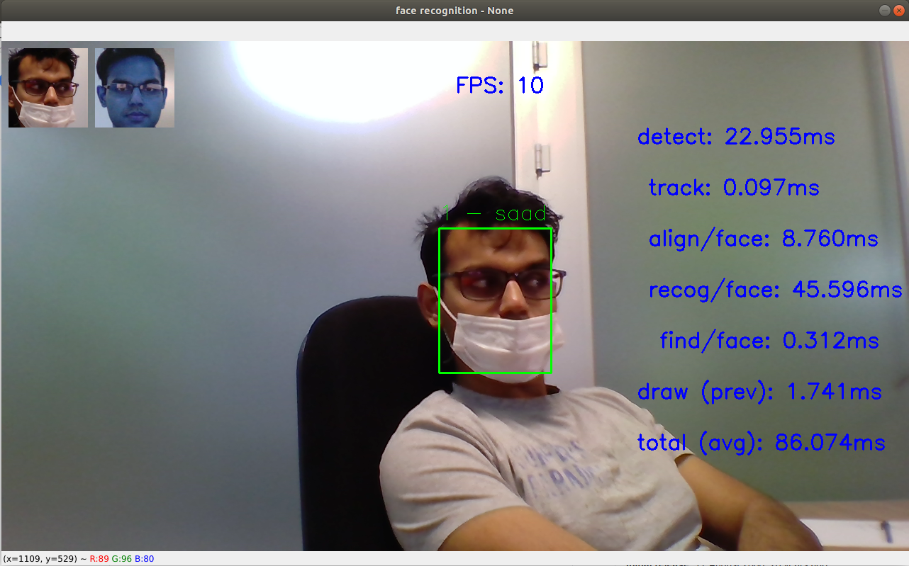

# DTSIS: Python Example for RockX
### Authored by: Syed Saad Saif

RockX is a library for rockchip accelerator devices that provided pretrained models for common AI tasks such as **Object Detection** and **Face Recognition**. 

The complete list of RockX modules is as follows:

{add python list:}


# Enviornment Setup

1. Create a conda virtual enviornment for RockX. Since we share a lot of packages from the **rknn_cpu** enviorment, let's clone it.

    _**Useful tip: You can find the names of the current envoirnment by running:**_ 

    > ### conda env list
    ```
    # conda environments:
    #
    base                     /home/dtsis-ai/miniconda3
    rknn_cpu              *  /home/dtsis-ai/miniconda3/envs/rknn_cpu
    test                     /home/dtsis-ai/miniconda3/envs/test
    ```
    To clone virtual enviornment run:

    > ### conda create --clone rknn_cpu --name rockx

1. To activate the **rockx** enviornment run:

    > ### conda activate rockx

1. Install the rockx pip package:

    * Navigate to ```~/ai/rockchip/rockx/RockX_SDK_V1.2.0_20200302/python```

    OR

    * Alternatively download the **RockX SDK** from:

        [Toybrick Download Page.](http://t.rock-chips.com/portal.php?mod=list&catid=11&product_id=4) (Translate it from Chinese)

        * Extract and navigate to python sub-directory.

    * Install pip3 package by running:

        _**Note: change the wheel filename in case of a different RockX version.**_

        > ### pip3 install RockX-1.2.0-py3-none-any.whl

    * Verify if the package is installed by running:

        > ### pip3 list | grep RockX

# Documentation

_**Note: Make sure that you are in the rockx virtual enviornment before you can access help.**_

The documentation for the rockx can be accessed by using the python **help()** command.

1. Open python interactively by running: 
> ### python3

2. On the python interpreter run the following commands:

```python
    from rockx import RockX
    help(RockX)

    > Help on class RockX in module rockx.RockX:
    >
    > class RockX(builtins.object)
    > |  RockX Class
    > |  
    > |  Methods defined here:
    > |  
    > |  __init__(self, module, target_device=None)
    > |      __init__
    > |      :param module: rockx module to create
    > |      :param target_device:
    > |  
    > |  release(self)
    > | 
      . 
      .
      .
```
3. You can also access a auto generated **HTML** version of this documentation here:

    [RockX Documentation.](https://htmlpreview.github.io/?https://github.com/SaadOjo/RKNN/blob/master/rockx.RockX.html)
# Python API Tutorial

_**Note: Make sure that you are in the rockx virtual enviornment before running RockX code.**_

1. Navigate to:  ``` ``` 

# Typical Use Case

Below we present a typical application that uses several RockX modules to perform face recognition. 

1. Navigate to: ```~/ai/rockchip/rockx/python_face_detection_code```

2. In the subfolder **faces** there are some example faces. The faces in this directory are used to create a database for facial recognition. Feel free to replace the images with your own examples. 
    
    * The **filename** of the photos represents the person identity in the database.

3. We need to create the face database before we can run face recognition. To create the face database run:

    > ### python3 recognition_inference.py --image_dir=./faces

    This will generate a **SQLite** database file named **face.db**.

4. To start the face recognition program run:

    > ### python3 recognition_inference.py

    

### Analyse the code to get a understanding about how to write a typical application using RockX api.