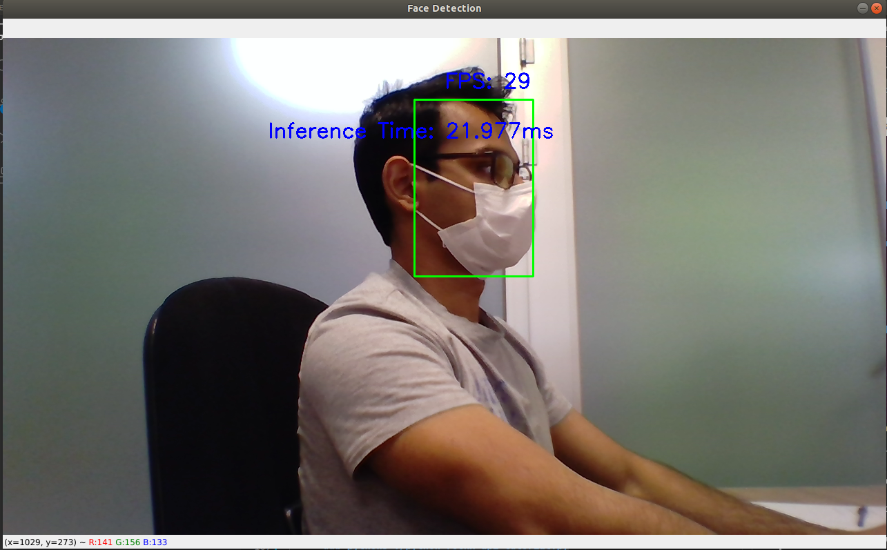

# DTSIS: Python Example for RockX
### Authored by: Syed Saad Saif

RockX is a library for rockchip accelerator devices that provided pretrained models for common AI tasks such as **Object Detection** and **Face Recognition**. 

The complete list of RockX functions is as follows:

* rockx_carplate_align
* rockx_carplate_detect
* rockx_carplate_recognize
* rockx_face_align
* rockx_face_attribute
* rockx_face_detect
* rockx_face_landmark
* rockx_face_pose
* rockx_face_recognize
* rockx_face_similarity
* rockx_head_detect
* rockx_object_detect
* rockx_object_track
* rockx_pose_body
* rockx_pose_finger

### Refer to the RockX documentation for further details.


# Enviornment Setup

1. Create a conda virtual enviornment for RockX. Since we share a lot of packages from the **rknn_cpu** enviorment, let's clone it.

    _**Useful tip: You can find the names of the current envoirnment by running:**_ 

    > ### conda env list
    ```
    # conda environments:
    #
    base                     /home/dtsis-ai/miniconda3
    rknn_cpu              *  /home/dtsis-ai/miniconda3/envs/rknn_cpu
    test                     /home/dtsis-ai/miniconda3/envs/test
    ```
    To clone virtual enviornment run:

    > ### conda create --clone rknn_cpu --name rockx

1. To activate the **rockx** enviornment run:

    > ### conda activate rockx

1. Install the rockx pip package:

    * Navigate to ```~/ai/rockchip/rockx/RockX_SDK_V1.2.0_20200302/python```

    OR

    * Alternatively download the **RockX SDK** from:

        [Toybrick Download Page.](http://t.rock-chips.com/portal.php?mod=list&catid=11&product_id=4) (Translate it from Chinese)

        * Extract and navigate to python sub-directory.

    * Install pip3 package by running:

        _**Note: change the wheel filename in case of a different RockX version.**_

        > ### pip3 install RockX-1.2.0-py3-none-any.whl

    * Verify if the package is installed by running:

        > ### pip3 list | grep RockX

# Documentation

_**Note: Make sure that you are in the rockx virtual enviornment before you can access help.**_

The documentation for the rockx can be accessed by using the python **help()** command.

1. Open python interactively by running: 
> ### python3

2. On the python interpreter run the following commands:

```python
    from rockx import RockX
    help(RockX)

    > Help on class RockX in module rockx.RockX:
    >
    > class RockX(builtins.object)
    > |  RockX Class
    > |  
    > |  Methods defined here:
    > |  
    > |  __init__(self, module, target_device=None)
    > |      __init__
    > |      :param module: rockx module to create
    > |      :param target_device:
    > |  
    > |  release(self)
    > | 
      . 
      .
      .
```
3. You can also access a auto generated **HTML** version of this documentation here:

    [RockX Documentation](https://htmlpreview.github.io/?https://github.com/SaadOjo/RKNN/blob/master/rockx.RockX.html)

    _**Note: You can generate the HTML version of python help by calling:**_

    > ###  pydoc -w rockx.RockX

    It will create the **HTML** File in the current Directory.

# RockX Python API Tutorial

_**Note: Make sure that you are in the rockx virtual enviornment before running RockX code.**_

This part of the document refers only to the RockX api. A programmers guide for Computer Vision Python Programming is also provided which can be accessed [here](python_programmers_guide). 

1. Navigate to:  ```~/ai/rockchip/rockx/python_rockx_api_tutorial```

2. Run the program by running:

    > ### python3 ./python_rockx_api_tutorial.py

    This should start the a program that performs **Face Detection**.



## Now let's review the code:

1. ### Import the libraries
    ```python
    import numpy as np
    import cv2

    from rockx import RockX
    from timeit import default_timer as timer
    from gfd.py.video.capture import VideoCaptureThreading
    ```
    We import numpy and opencv for image manipulation, timer to compute some metrics, VideoCaptureThreading to perform multithreading video capture and of course rockx.

1. ### Define helper libraries and functions

    We then define some helper classes to analyse performance metrics (FPS, inference time) and some other helper functions.  
    
    More details about the use of metrics and helper functions is provided in the [Computer Vison Python Programmer's Guide.](python_programmers_guide.md)

    ```python
    ##  Define Custom Helper Classes

    class fps_counter:
	def __init__(self):
		self.accum_time = 0
        .
        .
        .

    class text_overlay:
    def __init__(self, width, height):
        self.width = width
        .
        .
        .

    ## Define Helper Functions

    def handle_stop():
        .
        .
        .
    ```

    1. Initialize RockX module.

        ```python
        # Initialize the RockX module for Face Detection
        face_det_handle = RockX(RockX.ROCKX_MODULE_FACE_DETECTION, target_device=None)
        ```
        Here you can select the RockX module. Here we select the **Face Detection Module.**

    1. Setup the camera.

        ```python
        # Initialize and start multi-threaded video capture
        cap = VideoCaptureThreading(0, 1280, 720)
        cap.start()
        ```

        We initialize the camera object and then start the capture.

    1. Initialize objects for metrics. 
    
        ```python
        # Initialize FPS Counter
        counter = fps_counter()

        # Initialize Text Overlay Object
        to = text_overlay(1280,720)
        ```
        The counter is to measure FPS while. text overlay is a wrapper class to easily overlay text on the display screen.

    1.  **LOOP:** Capture frame and update fps counter.
        ```python
        try:
            while True:
                ret, frame = cap.read()
                counter.update()
        ```

    1. **LOOP:** Perform Face Detection.    
        ```python
                if ret == True:

                    in_img_h, in_img_w = frame.shape[:2]

                    #Perform Face Detection using RockX Module
                    last_time = timer()
                    ret, results = face_det_handle.rockx_face_detect(frame, in_img_w, in_img_h, RockX.ROCKX_PIXEL_FORMAT_BGR888)
                    face_detect_time = timer() - last_time   
        ```

        We check if the frame was sucessfully captured. Then we pass the frame to RockX to perform face recognition by calling. **face_det_handle.rockx_face_detect(~)**.
        
         We also pass the image height, image width and the image pixel format. The funtion returns us a ret value that indicates if the function call was sucessful and also a list of results that contains the bounding boxes of the detected faces.   

    1. **LOOP:** Draw face bounding boxes.
        ```python
                    for result in results:
                        
                        #draw bounding boxes
                        cv2.rectangle(frame, (result.box.left, result.box.top), (result.box.right, result.box.bottom), (0, 255, 0), 2)
        ```
        For each bounding box corresponding to each found face, we draw a rectangle around the face using opencv rectangle function..
                    
    1. **LOOP**: Overlay text and show frame.
        ```python
                    to.update_frame(frame)
                    to.overlay_text("FPS: " + str(counter.get_fps()),0.5)

                    to.overlay_text("Inference Time: " + '%0.3f' % (face_detect_time*1000) + 'ms', 0.3)
        

                    cv2.imshow('Face Detection', frame)  

        ```

        We use our **text overlay** class to overlay the **FPS** and **inference time (ms).** The resulting frame is then displayed on the window. 

    1. **LOOP**: We wait for key presses and stop the program in case of **ESC** key. 
        ```python
                c = cv2.waitKey(5) & 0xff
                if c==27:
                    handle_stop()
                    break

        except KeyboardInterrupt:
            handle_stop()
        ```
# Typical Use Case

_**Note: Make sure that you are in the rockx virtual enviornment before running RockX code.**_

Below we present a typical application that uses several RockX modules to perform face recognition. 

1. Navigate to: ```~/ai/rockchip/rockx/python_face_detection_code```

2. In the subfolder **faces** there are some example faces. The faces in this directory are used to create a database for facial recognition. Feel free to replace the images with your own examples. 
    
    * The **filename** of the photos represents the person identity in the database.

3. We need to create the face database before we can run face recognition. To create the face database run:

    > ### python3 recognition_inference.py --image_dir=./faces

    This will generate a **SQLite** database file named **face.db**.

4. To start the face recognition program run:

    > ### python3 recognition_inference.py

    

### Review the code to get a understanding about how to write a typical application using RockX API.